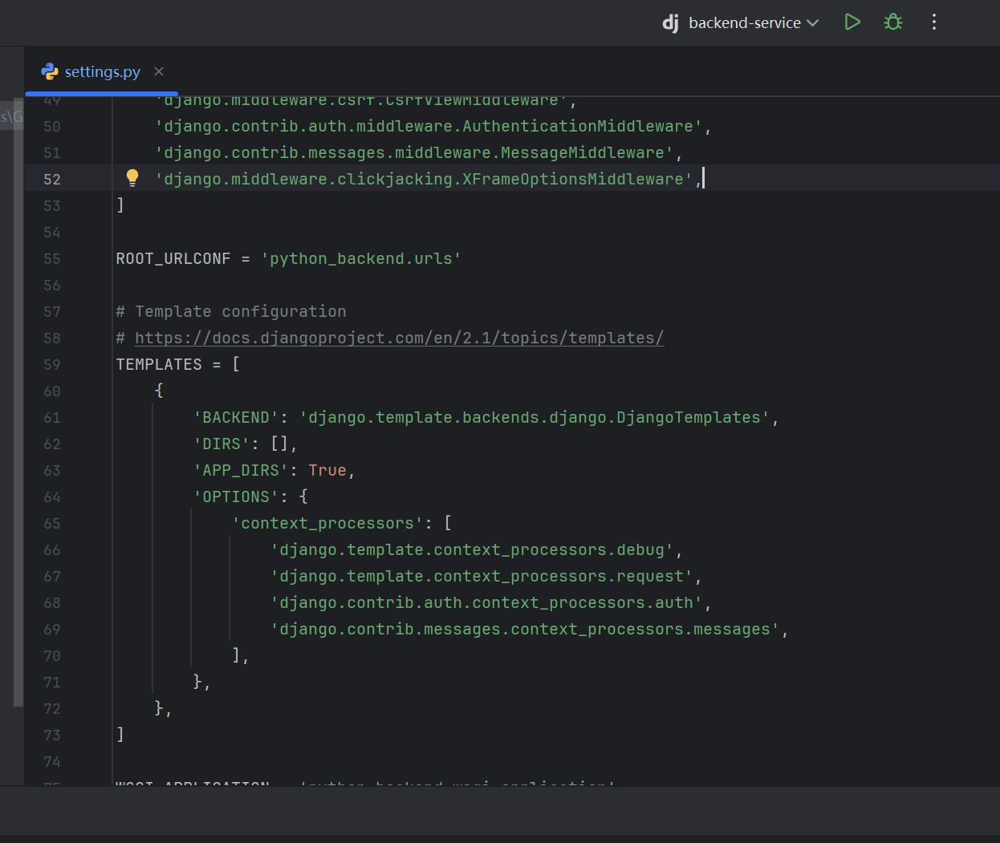
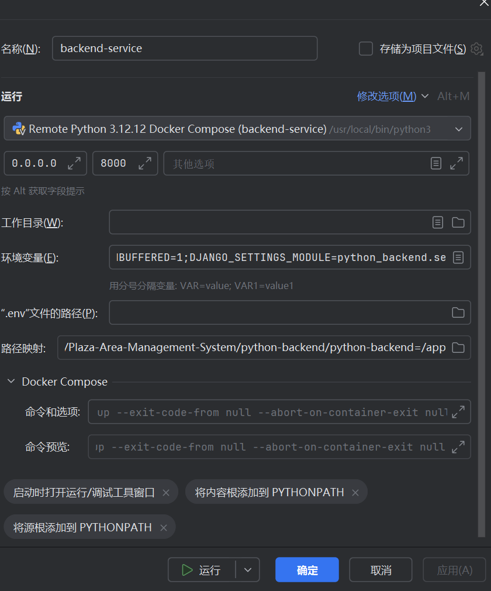
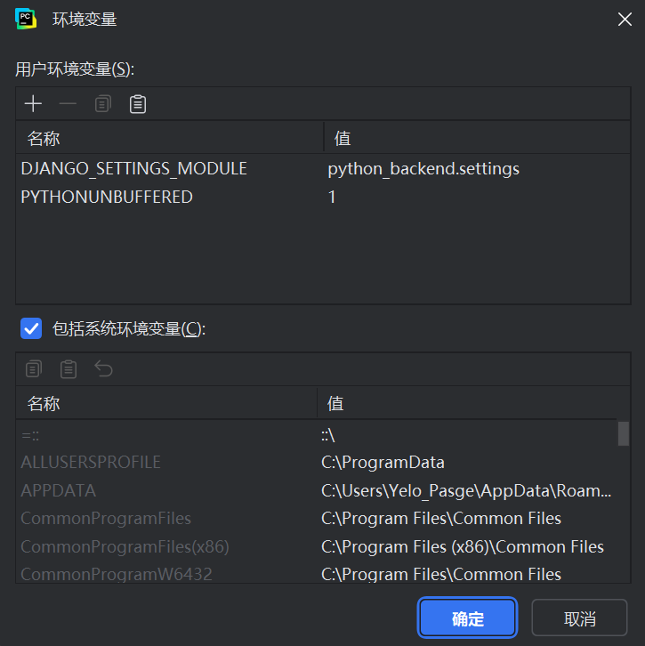

# 通过Pycharm连接docker容器操作流程

当pycharm和docker的连接配置好后，pycharm可以使用容器内的环境来在本地进行开发调试

## 一、 连接docker环境和容器内部的python解释器

1. 先打开项目，具体为该项目的根目录，即Plaza-Area-Management-System，并信任项目

2. 点击文件——设置——构建、执行、部署——docker，接着添加一个新的docker设置（通常会自动设置），如果正常连接，面板较下方位置会显示“连接成功”（设置前先打开docker desktop）

3. 然后是配置python解释器，在先前的设置中选择python——解释器——添加解释器——基于docker-compose。接着是选择本项目的docker-compose文件路径，并在service选项里选择backend-service，接着一直下一步知道创建应该就行，此时，pycharm已经连接上了容器内的python环境。

## 二、 配置Django相关设置

界面顶部应当可以看到Dj标识的后端项目，点开旁边的...编辑配置

配置如下图（本地的后端目录需要映射到容器/app里，同时有一个环境变量要更改：DJANGO\_SETTINGS\_MODULE,和图上一样）：

  

弄好之后可以试着运行调试一下，应该是可以在pycharm里方便地进行开发了。像VS就不能快捷调试，除非每次代码变更都docker compose build一波，太麻烦。

